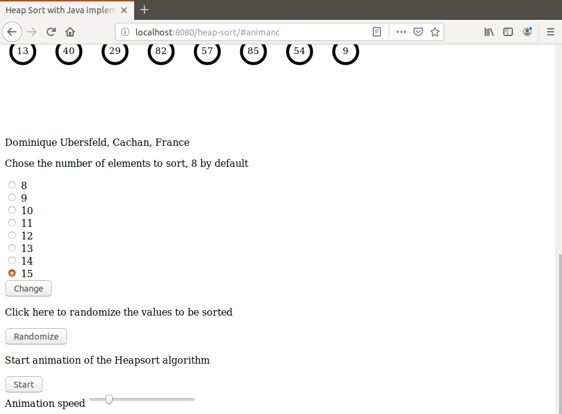
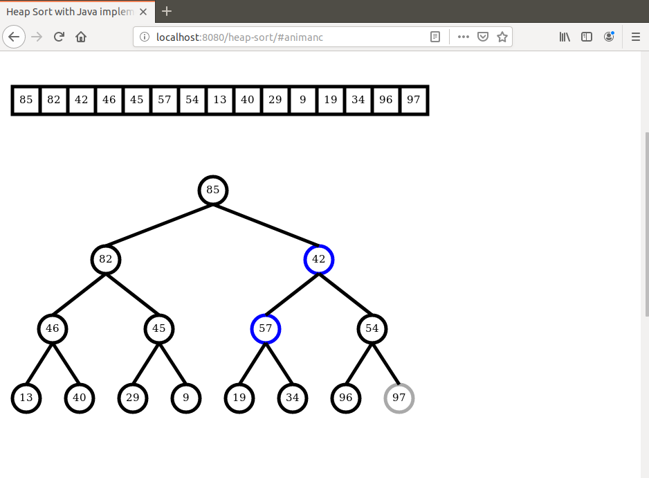
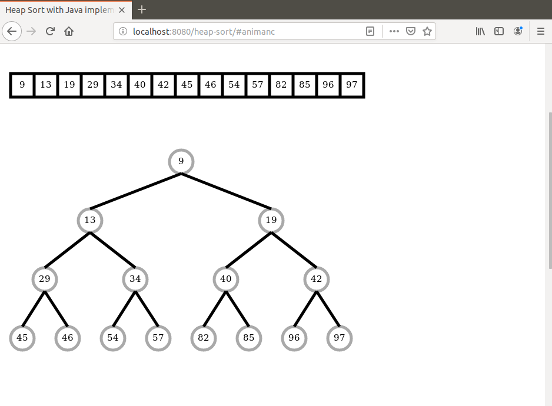

# heapsort-java-demo
I present here an animated demonstration of Heap Sort algorithm running on HTML5 Canvas. Here the Heap Sort algorithm itself is implemented in Java on server side. Javascript is used for display and initialization only. The communication between browser and server is implemented as an AJAX POST request.

# Launching the demo
To launch the demo run the command `mvn spring-boot:run` in project directory. When the application has started open a browser and hit URL `localhost:8080/heap-sort`.

Here are some screen shots that can be seen during the demo.

Sequence initialization

Sort step

Sort completed

For a video demo follow this link:

https://youtu.be/iy3sO8b4u8Y 

Dominique Ubersfeld, Cachan
